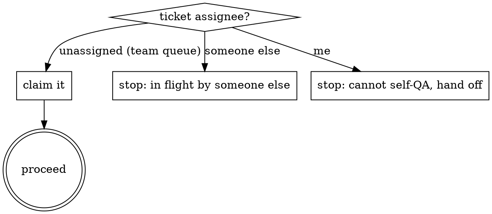

# Peer QA Review (Round 1)

A teammate has marked work as **ready for QA**. Your job: verify it before it goes to customer acceptance / QA2 / internal close. Round-1 QA is **not** rubber-stamping — re-run verification yourself, check formal correctness, check inventory and docs, post a structured QA comment, transition the ticket.

## When this skill applies

**Auto-trigger**:
- Ticket transitioned to **QA** status (or equivalent: "Review", "Code Review", "Ready for Review")
- Comment "ready for QA" / "ready for review" posted by the implementer
- User asks for "IT QA review", "internal QA", "peer review", "quality gate", "review and resolve"

**Skip** when:
- Ticket is still **In Progress** — ask implementer to transition first
- Ticket is **QA2** / customer-acceptance — different scope
- Ticket is already closed — post-mortem only; say so explicitly
- You are also the implementer — you can't self-review (see `references/edge-cases.md`)

## Companion skills

- **Required**: a ticket-system skill. For Jira: [`jira-communication`](https://github.com/netresearch/jira-skill). Stage 0 uses its `qa-gather.py` for single-call discovery (see `scripts/qa-gather.sh`).
- **Optional**: if your team has internal IT / maintenance / ITSM skills, consult them after this skill loads — they define project-specific overrides (project list, inventory CRUD, announcement channels, customer-vs-internal routing).

## Lifecycle (6 stages)

| Stage | Name | Output |
|-------|------|--------|
| -1 | **Claim** | Ticket assigned to me; not previously mine |
| 0 | **Discover** | Single-call gather of issue + comments + worklog + links + sibling tickets |
| 1 | **Formal correctness** | Description / linkage / console-output / worklog checks |
| 2 | **Functional + Inventory + Guardrails** | Reviewer re-runs verification; inventory updated; guardrails checked (adjacent components, shared-layer downstream, unchanged default path) |
| 3 | **Docs + Rollback + Communication** | Runbook stale? Snapshot taken? Announced if customer-affecting? |
| 4 | **Verdict** | Pass-resolve · Pass-QA2 · Bounce · Won't-do |
| 5 | **Comment + Transition** | Internal QA comment; on QA2, a separate customer handover comment; transition |

Full per-stage checks: `references/lifecycle.md` and `references/checklist.md`.

## Severity vocabulary

Reuse the standard Atlassian icon set. Do **not** invent new categories.

| Icon | Meaning | Action |
|------|---------|--------|
| `(/)` | verified / passed | none |
| `(x)` | **MUST**: blocking — cannot resolve | bounce to In Progress |
| `(!)` | **SHOULD**: real issue, non-blocking *here* | document; create follow-up if structural |
| `(i)` | **HINT**: improvement / next-time nice-to-have | document; no action required |
| `(?)` | open question | block on answer |

Rationale and examples: `references/severity.md`.

## Output: QA comment (+ handover on QA2)

Single Jira comment, header `h3. IT Internal QA`, h4 sections per pillar, severity icons throughout, verdict line at the end. Optional addendum comments for separable internal concerns (e.g. Confluence runbook review).

**On a QA2 verdict, post a second, separate comment — the customer handover.** The internal QA comment is addressed to IT and never states the acceptance check, so it leaves the approver lost. The handover is addressed to the approver, plain language, no infra jargon, no severity icons; it states what was delivered, the one acceptance check to perform, and the next step. Never hand the internal QA comment over as the handover.

Full template + filled examples (incl. customer handover): `references/comment-template.md`.

## Stage 0 — discover (one call)

```bash
# If jira-communication is installed:
${CLAUDE_SKILL_DIR}/scripts/qa-gather.sh <ISSUE-KEY>

# JSON for programmatic consumption:
${CLAUDE_SKILL_DIR}/scripts/qa-gather.sh <ISSUE-KEY> --json
```

Returns issue + comments + worklog + issue/web links + URLs extracted from description and comments (MR/PR/pipeline/commit/tag/release/issue) + sibling tickets — in one call. Falls back to multi-call if `qa-gather.py` is unavailable.

## Stage -1 — claim the ticket



The Round-1 QA queue is typically a **team queue** with no assignee. Self-assign and continue. If someone else holds it, stop. If it's already yours from earlier (you implemented it), you cannot self-QA — see `references/edge-cases.md`.

## Verdict routing

| Outcome | When | Action |
|---------|------|--------|
| **Pass — resolve** | All `(x)` clear, IT-internal scope (no customer affected) | transition QA → Closed/Done |
| **Pass — QA2** | All `(x)` clear, customer-affecting change | post the internal QA comment **and** a separate customer handover comment; transition QA → QA2, assign to product owner / customer |
| **Bounce — In Progress** | Any `(x)` | transition QA → In Progress, comment with the blocker, re-assign to implementer |
| **Won't-do** | Blocking external prerequisite missing | document, file follow-up ticket, resolve as Won't-do with reopen condition |

QA2-vs-internal-resolve decision rule: see `references/edge-cases.md`. When uncertain, default to QA2.

## References

- `references/lifecycle.md` — full per-stage detail
- `references/checklist.md` — every check, organised by pillar (F1–F8 formal, R1–R6 functional, G1–G3 guardrails, I1–I4 inventory, D1–D4 docs, B1–B3 rollback, C1–C3 communication, P1–P6 process compliance)
- `references/severity.md` — icon vocabulary and worked examples
- `references/comment-template.md` — Jira-wiki template + 3 worked examples (pass, bounce, won't-do)
- `references/edge-cases.md` — bounce, won't-do, self-review, unverifiable evidence, QA2 routing
- `references/anti-patterns.md` — what to flag in implementer's comments
- `references/frameworks.md` — light alignment notes (ITIL PIR, Scrum DoD)

## Scripts

| Script | Purpose |
|--------|---------|
| `scripts/qa-gather.sh` | Stage 0 single-call discovery (delegates to `jira-communication`'s `qa-gather.py`, falls back to multi-call) |

## Anti-patterns to flag

(See `references/anti-patterns.md` for the full list with examples.)

1. One giant final comment instead of one-per-step
2. Markdown leakage in Jira (`**bold**`, `# heading`, em-dashes `--`)
3. Inventory bulk-updated at end instead of immediately after each component
4. No console-output audit trail for key actions
5. Tag without pipeline (release pushed but CI was red or skipped)
6. **No re-execution by reviewer** — copy-pasting implementer's output is *not* QA
